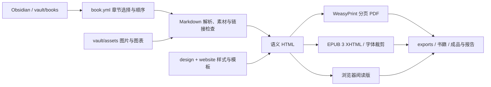

# 出版系统

## 设计取向

视觉转为纸质书与摄影刊物。宋体用于书名、章节与正文，辅助黑体用于图注。内页以纸白、暖黑、细线与首行缩进组织阅读，摄影封面和纯字体封面共享版心关系。

AIark 与 Alark 的署名体系保留，品牌名称以小字融入装帧。详细设计决策见 [纸本方向 v0.2](../design/editorial-direction.md)，可视化规范见 [visual-system.html](../design/visual-system.html)。

## 内容到成书

原稿是唯一内容源。PDF 与 EPUB 共享解析后的内容，但使用不同的展示样式。没有把 PDF 页面作为 EPUB 正文图片，从而保留文字选择、搜索、字号调整与内部链接。

目前还提供奢华传播、商业蓝图、投资年鉴和 FOLIO 摄影集主题。主题资源统一登记在 `scripts/alark_publishing/themes.py`，目录职责与扩展步骤见 [项目组织](architecture.md)。

## 页面决策

竖版 148 × 210 mm，内外边距区分装订侧与外侧。横版 240 × 170 mm，段落按连续文本组排成双栏，通栏图表在文本组之间出现，降低中文单行过长的问题。A4 用于工作手册与大图审阅。FOLIO 摄影集的横版单图使用图文左右排布，组照依照片顺序排列。

图像保持宽高比，图注与图像共同分页。长图使用单独的高度规则；横版图表限制高度，避免占满整个阅读画面。短代码块避免在页尾劈开。表格允许跨页，重复表头并尽量保持行完整。

章节从新页开始，但不强制只从右页开始，避免数字阅读中插入空白页。封面为第 1 页，目录显示实际 PDF 页码。当前使用章末注，不强行模拟每页页脚脚注。最终的孤行、空白和图表内部字号仍需要编辑者看样稿。

## 质量检查的边界

自动检查覆盖 EPUB 包结构、XML、manifest、spine、内部资源、锚点、PDF 页面尺寸、可提取文字、越界文字、字体嵌入与低于 250 DPI 的位图提醒。WeasyPrint 无法加载资源时中止构建。可额外调用 EPUBCheck 正式校验。

浏览器检查覆盖 1440 px 和 390 px 下的书架、设计手册、HTML 和 EPUB XHTML。样书已安排多章与少章、图文与纯文字、横图与长图、跨页表格与重复编号脚注的测试。六本样书覆盖五种代码主题；构建只读取 `vault`，转换测试在系统临时目录内创建独立原稿，不写入真实 `vault`。

PDF 当前为数字阅读版本。PDF/X、CMYK、出血、书脊及整张印刷封面应在确认印厂后另设输出配置。EPUBCheck 的通过也不等同于所有终端阅读器的视觉一致。

## 参考规范与工具

- [WeasyPrint：分页 CSS 与 PDF 用法](https://doc.courtbouillon.org/weasyprint/latest/common_use_cases.html)
- [W3C EPUB 3.3：包、导航与流式内容](https://www.w3.org/TR/epub-33/)
- [W3C EPUBCheck：正式校验工具](https://github.com/w3c/epubcheck)
- [Google Fonts：Noto Serif SC](https://github.com/google/fonts/tree/main/ofl/notoserifsc)
- [Google Fonts：Noto Sans SC](https://github.com/google/fonts/tree/main/ofl/notosanssc)

版本固定在 `requirements.txt`，原生依赖在 `environment.yml`，字体许可证保存在 `design/fonts`。构建不抓取网页或下载图片，确保原稿、资源与输出之间可以追溯。
