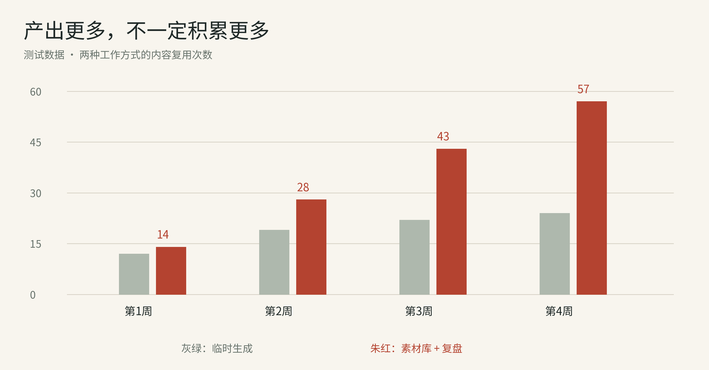

# 搭建内容工作系统

如果每次创作都从一张空白文档开始，灵感就会承担太多责任。一个稳定的内容系统应当让素材有去处、任务有入口、结果有反馈。AI 可以参与其中，但作者仍然需要决定什么值得写，以及什么可以发布。

![[assets/layout-lab/content-loop.png|图 2-1　观察、表达、连接、交付构成一个反馈循环。]]

## 把流程写成接口

每一步都约定清楚输入与输出，协作就会更容易。素材整理的输出可以是一组带来源的摘录，选题讨论的输出可以是一张问题卡，初稿的输出则是一段能够独立阅读的论述。

| 环节 | 输入 | 输出 | 作者检查什么 |
| --- | --- | --- | --- |
| 观察 | 对话与原始资料 | 问题卡片 | 问题是否真实 |
| 表达 | 卡片与可用案例 | 文章初稿 | 论证是否成立 |
| 连接 | 已发布的内容 | 读者反馈 | 是否理解读者 |
| 交付 | 被验证的需求 | 工具或服务 | 是否产生价值 |

表格可以帮助我们发现一个经常被忽略的事实：生产内容只是系统的一部分。如果发布后没有反馈入口，或者反馈无法回到下一轮选题，那么产量增加也可能只是增加了存储量。

### 给 AI 一个清楚的任务

在要求工具起草之前，先提供读者场景、可用材料、观点边界与输出结构。材料越清楚，检查结果的成本通常越低。下面是一份可以修改的任务说明：

```text
读者：第一次建立内容素材库的独立创作者
任务：用一个具体例子解释「问题卡片」的作用
材料：仅使用本章已有的观察记录
结构：场景 → 操作 → 结果 → 限制
检查：标出需要作者补充来源的事实，不虚构数据
```

## 让素材可以再次使用

同一段观察可以进入文章，也可以成为课程案例、社群讨论和服务说明中的一部分。复用的前提是保留上下文。只有一句被摘出的金句，往往不足以支撑下一次表达。



这里的图形只是一个视觉样例。它不证明任何工作方式必然优于另一种；真实复盘还需要统一统计口径，记录内容类型与投入时间，并说明样本范围。[^scope]

> [!tip] 本章行动
> 为最近的一篇文章整理一张问题卡，写下原始问题、关键证据、已发布链接和读者的新问题。下次创作时，先打开这张卡。

[^scope]: 本样书没有开展真实实验。图中数字由脚本手工设定，用于验证图片清晰度、色彩对比和图注分页。
